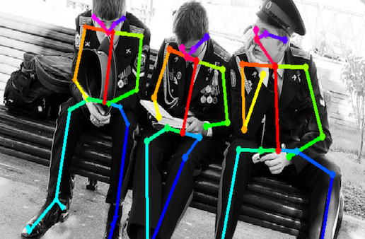

March 2022
# Human Pose Classifier

This project is a 2-stage pipeline for building a model that can classify human poses simply from an image.

The first stage utilizes the OpenPose algorithm to extract keypoints from the human body structure. The second stage consists of a feature engineering pipeline that takes the keypoints, processes it, and feeds it into an XGBoost model that is trained with supervised learning.

In this implementation, the model was trained to classify the (a) sitting, (b) standing, and (c) running positions, and it achieved 99% accuracy on an out of sample test set.

## OpenPose Algorithm

The OpenPose system (https://github.com/CMU-Perceptual-Computing-Lab/openpose) uses a multi-stage CNN to determine up to 25 keypoints of the human skeleton structure from a human photo.



The numerical output is as shown, with the "pose_keypoints_2d" values representing the x and y coordinates:
```
{'version': 1.3, 'people': [{'person_id': [-1], 'pose_keypoints_2d': [528.129, 224.146, 0.899704, 528.227,
384.891, 0.875981, 398.802, 381.476, 0.825535, 339.442, 563.087, 0.837085, 398.831, 583.999, 0.754884, 661.
05, 388.438, 0.812854, 709.903, 570.022, 0.855837, 709.852, 598.047, 0.808302, 528.231, 632.989, 0.690851,
458.309, 632.955, 0.661017, 346.433, 633.084, 0.837191, 301.074, 1062.88, 0.697597, 598.076, 632.97, 0.6506
05, 661.083, 633.003, 0.80519, 741.361, 1041.88, 0.706522, 500.236, 203.183, 0.932224, 552.735, 199.726, 0.
926887, 465.246, 234.665, 0.933074, 594.518, 231.129, 0.92563, 839.197, 1153.75, 0.571976, 846.149, 1143.2
5, 0.631755, 723.892, 1066.37, 0.45429, 157.773, 1132.79, 0.566524, 161.203, 1125.7, 0.497855, 328.958, 109
0.8, 0.606087], 'face_keypoints_2d': [], 'hand_left_keypoints_2d': [], 'hand_right_keypoints_2d': [], 'pose
_keypoints_3d': [], 'face_keypoints_3d': [], 'hand_left_keypoints_3d': [], 'hand_right_keypoints_3d': []}]}
```

## XGBoost Model

The feature engineering pipeline then takes the 15 most important keypoints (points 0-14 only) and augments these 15 datapoints with the following engineered data:
1. The length of the limb segments
2. The angle between key joints (cosine of vectors)

Refer to 'train.ipynb' for detailed implementation.


With a total of 52 features, the XGBoost model is trained to classify the poses into sitting, standing, or running. While only 3 different poses were used, this training process and feature engineering steps can be used for a wider variety of poses.